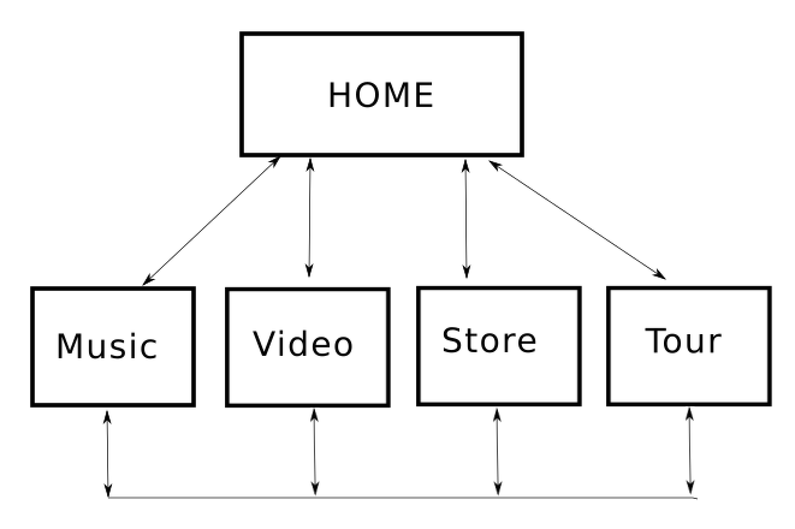

# USER CENTRIC FRONT END MILESTONE PROJECT

## STATIC WEBSITE FOR THE FOLK-ROCK BAND _BIG THIEF_

## Project Overview

For this project, I have built a mobile-first responsive website for the rock group Big Thief. It can be viewed [here](https://select-8.github.io/ucfed-milestone-no1/index.html).

Relatively new to the music of Big Thief, from the moment I heard the song [_Cattails_](https://youtu.be/dUR-Ad8QcmA) I was captured by the subtle oddness of their sound and their image. While keeping this in mind, my goals for the project are to make the best Big Thief site I can, building upon the processes and technologies outlined throughout the User Centric Front End Development modules, and to take some initial steps towards developing my own working method as a web developer.

For the most part I'm happy I have met these goals, at the very least I now have a much clearer understanding about what I don't know yet!

The site consists of 5 linked pages. It incorporates main navigation, grid layout, display and text utilities, and modal components provided by Bootstrap.

I used Notion as a project management tool. I created a sprint with bite-sized tasks. This can be viewed by anyone with an @codeinstitute.net email [here] (https://www.notion.so/liamucmsp/e0125f6404bb4daaa59b5b10da2a7415?v=04742600702b4e64a04207bb24732246).

### Strategy Plane

#### Owner Stories

The band has a strong brand and aesthetic that suggests the standard indie-music trope of "It's all about the music". The website needs to reflect this while still presenting commercial opportunities outside of music streams. 

To this end, we need a website to:

1. Promote the band's formulated brand and natural persona.

2. Target fans with official merchandise and tickets to live shows

3. Showcase music

   - audio clips

   - new album just out to promote 

   - rave reviews from the right places

4. Publicise availability (tour)

   - dates, locations, links to buy tickets

   - hero image of a live show atmosphere

4. Show photos of the band members

     - should fit the brand

5. Show videos

     - a mix of staged and live

7. Show social media presence

8. Give fans a way to get further relevant information

    - mailing list subscription 

#### Inspiration - The persona of Big Thief

Inspiration for the site's content as well as the general look and feel comes from the band's official website, their music and lyrics, and from various interviews with the group. Their persona, in particular that of the band's leader and songwriter Adrianne Lenker, is one of mystery, darkness, and contrast.

      I'll be your real tough cookie with the whiskey breath
      I'll be a killer and a thriller and the cause of our death 
           -
      Lyrics by Adrianne Lenker from the song "Paul"

- https://bigthief.net 
- https://www.stereogum.com/2014756/adrianne-lenker-big-thief-interview-abysskiss/franchises/interview/

## UX Process

### Scope Plane

#### User Stories 

Two types of users can be defined. While all stories below apply to both users, their priorities in coming to the site might be different.

1. I’m already a fan of the band, I have all their albums.
2. I have just heard of this band and I want to find out more.

    - As a user, I expect the site to reflect the persona of the band.
    - As a user, I want easy access to unique content i.e. access to an official store, definitive tour listings.
    - As a user, I want to be able to seamlessly navigate to the content I want.
    - As a user,  I want to seamlessly wander the site until I find something that interests me.
    - As a user, I want access to the band's social media.
    - As a user, I want to access the band's music.
    - As a user, I want to see music videos.
    - As a user, I want to see live performances.
    - As a user, I want access to biographic information on the group.

### Structure Plane
#### Information Architechture

### Skeleton Plane
#### Wireframes

Wireframes can be viewed [here](user_experience_assets/).

wireframe_1.jpg illustrates my original mind dump.

Initially, I had planned for the site to scroll vertically, with distinct page blocks for each section. However, after I built out the bones of the site with some scratch components in place, I felt a sticky navbar was not the correct choice for this site and I was not able to find a non-javascript, CSS alternative which I liked, to do navigation back up and through the pages. So, in the end, I decided to go with single pages. Finding a nice way of internal navigation for a vertical scrolling site is a goal I've set myself for future projects.

The idea of pages split into 4 quads in a single view came to me early in the project. I wanted symmetry of content with left/right & top/bottom used to imply levels of importance in the content for the user. On moving from desktop to mobile the bottom right would fall down/off first, then bottom left, top right, top left.

In hindsight, this approach to the UX has not worked as I would have liked. For both the music and video pages the content was a bit squeezed in. Subsequently, in the music page, I set the content into two halves. Where the top half is dominant, promoting the new album and the bottom half has some room for the content to breathe.

I did not wireframe the tour page. I knew I would use a Bootstrap table and that it would mirror the home page.

### Surface Plane
#### Colour 

I wanted to use a high contrasting palette of colors which could portray the sense of mystery and intensity outlined in the user stories. To this end, the site is bookended by the lighter in tone, pink backgrounded, Home & Tour pages, while the core pages of music, videos, and store are dark with high contrast between the blacks, whites, and oranges.

Light home -> darker content pages -> light tour

This is intended to make the user feel like they are going "inside" the site from the home page.

#### Typography

The site makes use of two fonts.

I wanted to use a serif font for banner headings like the band's name on the home page, and sans serif for content paragraphs. 

I choose Cinzal as my serif font. Using a serif gives a sense of grandeur to the title and fits with the band's brand. 

Google fonts suggested Lato as a complimenting font.

The formatting of the text and some decoration on the quotes section of the music page proved to be the most challenging aspect I faced in terms of type.

I would have liked to have been able to do more with the video titles.

The store page makes heavy use of Font Awesome icons. Ideally, I would have had custom made SVGs that better suited the band's persona. Saying that, in general, I think the quad approach to the design works best on this page.

#### Images

The home page image was chosen for its clear and natural portrayal of the group. The tone and form of the image informed the overall aesthetic of the site.
The tour page was chosen to give a sense of the atmosphere a user can expect at one of Big Thief's shows i.e. up close, intense and intimate. 

## FEATURES

#### Navbar
This is a Bootstrap component. Fixed to the top of the screen, it
collapses to dropdown for mobile screens. I choose to justify the link text across the bar to give that sense of symmetry and balance to the site. I did play with the idea of setting the button itself in the centre of the navbar but this just looked a bit weird.
As it is, I feel the navigation allows users to easily jump from one page to another and back without any confusion.

#### Footer

Apart from using W3Schools CSS for the drop up effect and reappropriating some Whiskey Drop code for the modal and using Font Awesome icons, the footer is 100% custom built!
On the right, we have some social icons as block text which collapse to a social button drop-up for mobile. On the left, we have a mailing icon which houses a modal pop-up form. This responsive feature allows users to navigate to the band's social sites in a new tab. 

The block stacking means, for the most part, the icons will not overlay the content on medium to large screens.

The Wikipedia link meets the needs of the new user outlined in the user stories above. It also meets the needs of the owner in keeping content inline with the persona of the band.

Has a mailing icon which has a modal form pop up on click.

Both of these features use colour and hover effects which are responsive to the user being in either one of the light or dark pages

#### Iframes

The music and video pages use Spotify and YouTube embed code respectively. These meet the user and owner needs outlined above.

#### Ticket Links

Every link links to the same Ticketmaster page. I had toyed with the idea of having a single link, sitting in either the banner text, the image or the navbar but in the end, I decided that this would distract from the overall design of the page. For the same reason social and mailing list links do not appear on this page.

#### Left to Implement

- Iframes should be more responsive to media screen size.
- Tour page should have some sort of down pointer on large and very large screens so users know, without any confusion, to scroll down for some content. 
- To make the band's name appear opaque behind the dropdown menu. On the home page this would look like the dropdown falling over the banner text.
- The social menu should close on click of the social 'S' button. I could not find a CSS only way to do this.

## Testing

My testing spreadsheet can be found [here](testing/site-tests.xls).

Mostly my breakpoints happen at the mid-size screen level, therefore I tested the responsiveness of content either side of this divide.

Further to this, the site was tested on a variety of devices using Google Chrome Dev Tools and physically using a RedMi Android phone, an iPhone 8 and a Samsung Galaxy Tablet.

####Results

 - Conflict in z-indexing of music/video/store content/links and the mailing/social links that make up the footer. It's a fine margin, but when they overlap only the higher indexed item will work. This does not meet the users need for seamless navigation and control of the content.

 - Scrolling was found to be laggy on the Galaxy Tablet.

 - Spotify iFrames are too wide on iPhone 8.

 - Not enough space under the video page.

 - White space on IPad Pro in Portrait mode.

Through the project, I made use of the CSS code snippet below. I found it very useful for finding stray padding and margins in CSS.

     *  {
    background: #000 !important;

    color: #0f0 !important;

    outline: solid #f00 1px !important;
    }

## Deployment

I have Git for versioning my code. The site is deployed to GitHub pages at the address given at the top of this readme.

There is no difference between the development and deployed versions of the site.

## Technologies Used

##### LANGUAGES
- HTML
- CSS

##### VERSION CONTROL
- GIT

##### FRAMEWORKS & APIS
- BOOTSTRAP 4
- FONT AWESOME
- GOOGLE FONTS
- JQUERY
- POPPER

##### SOFTWARE AND SERVICES
- AWS C9 IDE
- VISUAL STUDIO CODE
- GITHUB
- INKSCAPE

##### EDITORS
- SUBLIME
- ATOM

##### VMWARE
- UBUNTU V18.04

##### HARDWARE
- MAC OSX

##### PROJECT MGMT
- SLACK
- NOTION

##### VALIDATION
HTML : https://validator.w3.org/
CSS : https://jigsaw.w3.org/css-validator/

## Credits
I used [this](https://stackoverflow.com/questions/41651612/how-to-align-icon-to-center-inside-div-element) to center some content, turned out to be more hassle than it was worth.

The bones of the modal was taken from Matt's Whiskey Drop walkthrough.

The drop-up CSS came from W3Schools [here](https://www.w3schools.com/howto/howto_css_dropup.asp).

The Home page banner image is by Michael Buishas and was found on NPR's site [here](https://www.npr.org/sections/allsongs/2019/02/26/697748344/big-thief-announces-a-new-album-u-f-o-f-and-releases-its-first-single).

The Tour page image is by Kate Johnston and was found on The Skinny website [here](https://www.theskinny.co.uk/music/live-music/reviews/big-thief-swg3-glasgow-19-may)

