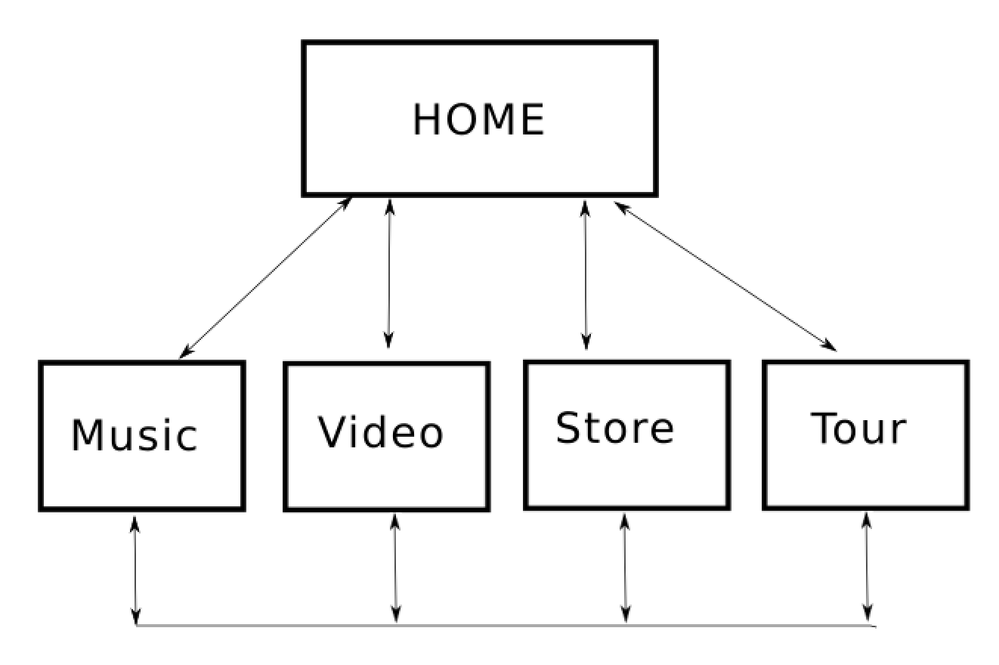

# USER CENTRIC FRONT END MILESTONE PROJECT

## STATIC WEBSITE FOR THE FOLK-ROCK BAND _BIG THIEF_

### Project Overview

For this project, I have built a mobile-first responsive website for the rock group Big Thief. It can be viewed [here](https://select-8.github.io/ucfed-milestone-no1/index.html).

Relatively new to the music of Big Thief, from the moment I heard the song _Cattails_ I was drawn in by their sound and aesthetic. My hope is this has somehow seeped into the project presented here.

My primary goal was to make the best site I could, utilising and building upon the processes and technologies outlined throughout the User Centric Front End Development modules and to take the initial steps towards developing my own working method as a web developer. 

For the most part I'm happy I have met these goals, at the very least I now have a much clearer understanding about what I don't know yet!

The site consists of 5 linked pages. It incorporates main navigation, grid layout, display and text utilities, and modal components provided by Bootstrap.

All links have functioning endpoints. The mailing list goes nowhere.

----

#### Owner Stories (strategy and scope)

The band has a strong brand and aesthetic that suggests the standard indie-music trope of "It's all about the music". The website needs to reflect this while still presenting commercial opportunities outside of music streams. 

To this end, we need a website to:

1. Promote the band's music and brand

2. Target fans with merchandise and tickets to live shows

3. Showcase music

 - audio clips

 - new album just out to promote 

 - rave reviews from the right places

4. Publicise availability (tour)

 - dates, locations, links to buy tickets

 - hero image of a live show atmosphere

4. Show photos of the band members

     - should fit the brand

5. Show videos

     - a mix of staged and live

7. Show social media presence

## UX Process

#### User Stories

As a user I want to be able to:

 1 seamlessly navigate to the content I want.

 2 seamlessly wander the site till I find something that interests me

Two types of users can be defined:

1. I’m already a fan of the band, I have all their albums

    - As a user I expect the site to reflect the persona of the band.
    - As a user, I want easy access to unique content i.e. access to an official store, definitive tour listings.

2. I have just heard of this band and I want to find out more…

    - As a user, I want access to the band's social media.
    - As a user, I want to hear some of this bands music.
    - As a user, I want to see their music videos.
    - As a user, I want to see some live performances.
    - As a user, I want access to biographic information on the group

_In potential conflicts between users requirements, reflecting the band's persona wins out_

#### Information Architechture

#### Wireframes

#### Inspiration - The persona of Big Thief

Inspiration for the site's content as well as the general look and feel came mainly from the band's own website, their music and from various interviews I have read or seen with the group. Their persona, in particular that of the band's leader and songwriter Adrianne Lenker, is one of mystery, darkness, and contrast.
While the darkness and contract are there in the colour palette used, I found a conflict in achieving that sense of mystery. While the group is not one to have a bio section, user 2 as defined above could want some biographic information before moving further into the site. I compromised with a link in the social bar to Wikipedia.
The album review quotes are not fitting with the persona but 

- https://bigthief.net 
- https://www.stereogum.com/2014756/adrianne-lenker-big-thief-interview-abysskiss/franchises/interview/

#### Colour

As noted above I was aiming to use high contrasting colors that portray a sense of dark but to do this without overkill. To this end, the site is bookended by the lighter in tone Home & Tour pages while the core content of music, videos, and the store page are dark with high contrast between the blacks and oranges.

Light home -> darker content pages -> light tour

This is intended to make the user feel like they are going "inside" the site from the home page.

#### Typography

In line with the tone of mystery, the site is light on text  
Should be clear what you will get

## FEATURES

#### Existing
 Navbar- bootstrap
 Footer
- homemade hack without using bootstrap or javascript
- difficult to align
- duplicates code

DECided to go with single pages because I don't like a sticky header and early on couldn't find a simple enough alternative to do the nav back up the pages.

#### Left to Implement

- iframes responsive to media screen size
- floating down pointer on tour, disappear on scroll
- size of things in music and video not good, better to do media queries
- no social on tour page. why?

## Testing

Music was not working on all screens so merged containers of text and main Spotify frame.
Now that album stands out a bit more as the main new album.

Click for each page to every link and back

Test all iframe content
RELATIVE PATHS USED

     *  {
    background: #000 !important;

    color: #0f0 !important;

    outline: solid #f00 1px !important;
    }

## Deployment

Git for versioning
Constant Commits
GitHub Pages

## Technologies Used

##### LANGUAGES
- HTML
- CSS

##### VERSION CONTROL
- GIT

##### FRAMEWORKS & APIS
- BOOTSTRAP 4
- FONT AWESOME
- GOOGLE FONTS
- JQUERY
- POPPER

##### SOFTWARE AND SERVICES
- AWS Could9 IDE
- VISUAL STUDIO CODE
- GITHUB
- INKSCAPE

##### EDITORS
- Sublime
- Atom

##### VMWARE
- Ubuntu V18.04

##### HARDWARE
- Mac OSX

##### PROJECT MGMT
- SLACK
- Notion

## Credits
https://stackoverflow.com/questions/41651612/how-to-align-icon-to-center-inside-div-element

